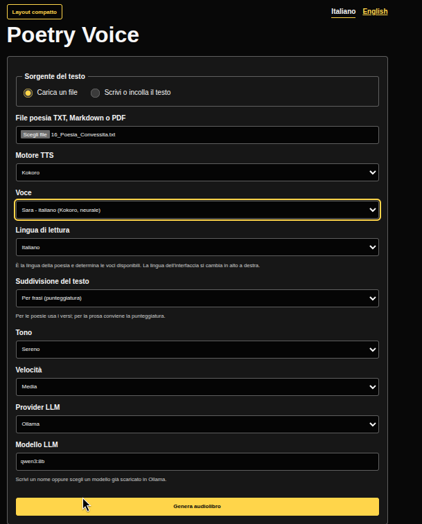
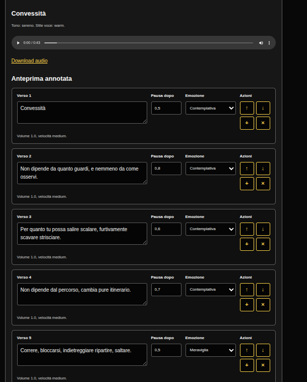

# Poetry Voice

> 🇬🇧 **[English version](README.en.md)**

Poetry Voice e un'applicazione open source in Python che trasforma poesie in audiolibri espressivi.

L'obiettivo non e fare semplice text-to-speech. Poetry Voice analizza prima la poesia, individua ritmo, pause, emozioni ed enfasi, poi invia un piano di lettura annotato a un motore TTS configurabile. Il risultato desiderato e una lettura calda, elegante e rilassante, piu vicina a un narratore umano attento che a una voce meccanica.

Il progetto e pensato con particolare attenzione all'accessibilita. Una voce paziente e ben modulata puo diventare un modo per accompagnare chi non vede, o vede con difficolta, nell'ascolto di poesie e altri testi: la pagina che non si puo guardare torna comunque a parlare.

*Ispirato da Massimo Bianchini.*



## Accessibilita

L'attenzione all'accessibilita vale anche per chi installa e usa il programma.
Per questo ogni operazione e riducibile a **un solo comando da copiare**, e
l'interfaccia web e progettata per screen reader, alto contrasto e navigazione
da tastiera. Il layout accessibile e il default; un pulsante **Layout
compatto** attiva una resa piu densa per chi non ne ha bisogno.

## Cosa fa

- Legge poesie da file TXT, Markdown e PDF, o da testo incollato nella UI.
- Preserva il piu possibile gli a capo originali, anche dai PDF; in alternativa
  divide il testo per frasi in base alla punteggiatura (per la prosa).
- Usa un LLM per analizzare tono, emozione, ritmo, pause ed enfasi.
- Produce un'annotazione prosodica JSON estendibile e modificabile dalla UI.
- Invia l'annotazione a un motore TTS sostituibile (Piper, Kokoro, XTTS).
- Esegue post-processing audio con FFmpeg ed esporta WAV, FLAC, MP3 e OGG.
- Offre una CLI e una interfaccia web FastAPI accessibile e bilingue (it/en),
  con voci italiane e inglesi.
- Gira sia in locale su CPU sia in un container Docker con GPU NVIDIA e Ollama incluso.

## Come usarlo

Prima di tutto scarica il progetto:

```bash
git clone https://github.com/manzolo/poetry-voice.git && cd poetry-voice
```

Poi scegli **una** delle due vie. Non servono entrambe.

### Standalone — senza Docker e senza GPU (la piu semplice)

Prerequisiti: **Python ≥ 3.12**, `make` e `ffmpeg` (`espeak-ng` facoltativo,
come voce di ripiego). Su Ubuntu/Debian un comando solo:

```bash
sudo apt install make ffmpeg espeak-ng
```

Gira sul tuo computer usando la CPU. Un comando solo:

```bash
make local
```

Poi apri `http://127.0.0.1:8000`.

Guida completa: **[docs/standalone.md](docs/standalone.md)**.

### Docker con GPU NVIDIA (qualita massima, Ollama incluso)

Prerequisiti: Docker con Compose, `make`, driver NVIDIA e
[NVIDIA Container Toolkit](https://docs.nvidia.com/datacenter/cloud-native/container-toolkit/latest/install-guide.html).

```bash
make setup
make up
```

Poi apri `http://localhost:8000`.

Guida completa: **[docs/docker.md](docs/docker.md)**.

## L'interfaccia web

Carichi (o incolli) il testo, scegli motore, voce, lingua, tono e velocita, e
ottieni l'audiolibro con un log di avanzamento che puoi fermare in ogni
momento. L'anteprima annotata e modificabile verso per verso e si puo
rigenerare senza rifare l'analisi.



<details>
<summary><strong>Tutte le funzioni dell'interfaccia</strong></summary>

La UI web supporta upload della poesia **oppure** scrittura/incolla diretta del
testo (interruttore "Sorgente del testo"), scelta del motore TTS, lingua, tono e
velocita di lettura, modifica del testo estratto, indicazioni libere per il LLM,
scelta di provider e modello LLM (il campo modello propone in tendina i modelli
gia scaricati in Ollama, ma resta scrivibile a mano), anteprima annotata
modificabile (testo, pausa ed emozione per ogni verso, con riordino dei versi),
log di avanzamento con barra di progresso, ascolto e download dell'audio.

Durante l'elaborazione i parametri scompaiono e resta solo l'avanzamento, con
un pulsante **Ferma elaborazione** per annullare il job; i campi ricompaiono a
fine elaborazione, in caso di errore o di annullamento.

Il testo si puo suddividere **per versi** (a capo, default: giusto per le
poesie) oppure **per frasi** in base alla punteggiatura (meglio per la prosa,
dove gli a capo del file non hanno valore ritmico). Opzione disponibile nella
UI, da CLI (`--split lines|sentences`) e in `config.yaml`
(`pipeline.segmentation`).

L'interfaccia e bilingue: italiano e inglese, con selettore in alto a destra
(la scelta viene ricordata). La lingua dell'interfaccia e indipendente dalla
lingua di lettura della poesia: l'elenco delle voci si filtra in automatico
per motore e lingua di lettura selezionati.

Flusso consigliato:

1. Carica un file e genera il primo audiolibro.
2. Il testo estratto resta nella form in alto.
3. Modifica versi, punteggiatura o aggiungi indicazioni.
4. Nell'anteprima annotata puoi modificare ogni verso, la pausa e l'emozione, e riordinarli.
5. `Rigenera da anteprima modificata` sintetizza di nuovo senza rifare l'analisi LLM.
6. `Genera audiolibro` rifa invece l'analisi partendo dal testo modificato.

Scelte di accessibilita della UI: testo grande, alto contrasto, focus da tastiera
ben visibile, HTML semantico, label esplicite, struttura compatibile con screen
reader e controlli audio standard del browser. Il layout accessibile e il
default; il **Layout compatto** (scelta ricordata dal browser) riduce testo e
spazi senza toccare contrasto e focus.

</details>

## Approfondimenti

<details>
<summary><strong>Architettura</strong></summary>

```text
file input
   |
   v
parser
   |
   v
analisi LLM
   |
   v
annotazione prosodica JSON
   |
   v
motore TTS
   |
   v
post-processing FFmpeg
   |
   v
audiolibro finale
```

Moduli principali:

```text
poetry_voice/
  cli.py             entrypoint CLI
  config/            configurazione YAML + Pydantic
  llm/               astrazione provider LLM
  parser/            parser TXT, Markdown e PDF
  tts/               astrazione provider TTS
  pipeline/          orchestrazione end-to-end
  ui/                interfaccia web FastAPI
  audio.py           post-processing FFmpeg
  models.py          modelli dati condivisi
tests/               test unitari
```

</details>

<details>
<summary><strong>Annotazione prosodica</strong></summary>

Il LLM restituisce JSON strutturato di questo tipo:

```json
{
  "title": "L'infinito",
  "author": "Giacomo Leopardi",
  "language": "it",
  "mood": "nostalgico",
  "overall_speed": "slow",
  "voice_style": "warm",
  "lines": [
    {
      "text": "Sempre caro mi fu quest'ermo colle,",
      "pause_before": 0.0,
      "pause_after": 0.8,
      "breath_after": false,
      "emphasis": ["Sempre"],
      "emotion": "wonder",
      "volume": 1.0,
      "speed": "slow",
      "pitch": 1.0,
      "metadata": {}
    }
  ],
  "metadata": {}
}
```

Lo schema e volutamente estendibile, cosi nuovi motori possono usare metadati piu ricchi senza modificare parser o pipeline.

Il testo dei versi non viene mai rigenerato dall'LLM: il modello riceve i versi
numerati e restituisce solo annotazioni indicizzate, riattaccate al testo
originale. Un LLM in difficolta puo al massimo degradare le pause, mai i
contenuti letti.

</details>

<details>
<summary><strong>Configurazione</strong></summary>

La configurazione vive in `config.yaml` (per Docker) o nei valori predefiniti
(in locale). Esempio:

```yaml
llm:
  provider: ollama
  model: qwen3:8b
  base_url: http://localhost:11434
  temperature: 0.2
  # Finestra di contesto Ollama: alzala se i testi lunghi vengono troncati.
  num_ctx: 8192
  # Testi oltre questa soglia di versi vengono analizzati a blocchi di strofe.
  max_lines_per_chunk: 24
  language: it
  reading_tone: caldo
  reading_speed: slow
  reading_instructions: ""

tts:
  engine: piper
  speaker: it_IT-paola-medium
  language: it
  device: cuda
  model_path: /models/piper/it_IT-paola-medium.onnx
  sample_rate: 24000
  speed: slow
  sentence_silence: 0.8

audio:
  format: mp3
  bitrate: 192k
  lufs: -18
  noise_reduction: false
  fade_ms: 120
  light_compression: true

pipeline:
  output_dir: outputs
  keep_intermediates: false
  # "lines" = un verso per riga (poesie); "sentences" = frasi (prosa).
  segmentation: lines
```

In locale i target `make local-*` usano `config.local.yaml` e tengono i dati
sotto `local-data/` (di proprieta dell'utente, separati dalle cartelle di Docker).
`device: cuda` viene comunque ignorato da Piper, che gira su CPU.

</details>

<details>
<summary><strong>Parser supportati</strong></summary>

| Formato | Estensione | Implementazione |
| --- | --- | --- |
| Testo semplice | `.txt` | lettura UTF-8 |
| Markdown | `.md`, `.markdown` | `markdown-it-py` |
| PDF | `.pdf` | estrazione layout con `pypdf` |

</details>

<details>
<summary><strong>Provider LLM</strong></summary>

Il layer LLM e astratto. Le modalita attuali sono `ollama` (predefinito),
`openai` e `generic`. Il provider riceve la poesia e restituisce un
`PoemAnnotation` validato. Se la chiamata al LLM fallisce, un fallback euristico
genera un'annotazione di base per mantenere usabile il resto della pipeline.

</details>

<details>
<summary><strong>Motori TTS e voci</strong></summary>

Il layer TTS e astratto. Gli adapter attuali sono `piper` (predefinito),
`kokoro`, `dia` e `xtts`. Il motore si sceglie via YAML:

```yaml
tts:
  engine: piper
```

Le voci sono legate al motore **e alla lingua**: la UI mostra solo quelle
compatibili con motore e lingua di lettura selezionati, e il backend rifiuta
combinazioni incompatibili invece di usare silenziosamente il fallback. Da CLI,
`--language en` senza `--speaker` sceglie da solo una voce inglese adatta.

Per voci piu naturali c'e il motore **Kokoro** (neurale), che rispetta le pause
per verso. Richiede lo stack neurale: usalo via Docker (consigliato) oppure in
locale con Python ≤ 3.13 ed `espeak-ng` (i wheel di spacy/kokoro non esistono
ancora per Python 3.14). Tutte le pause per verso sono rispettate sia con Piper
sia con Kokoro.

| Voce | Chiave | Motore | Lingua | Note |
| --- | --- | --- | --- | --- |
| Paola | `it_IT-paola-medium` | piper | it | qualita media, default consigliato |
| Riccardo | `it_IT-riccardo-x_low` | piper | it | molto leggero, qualita inferiore |
| Lessac | `en_US-lessac-medium` | piper | en | inglese US, qualita media |
| Ryan | `en_US-ryan-medium` | piper | en | inglese US, qualita media |
| Sara | `if_sara` | kokoro | it | neurale |
| Nicola | `im_nicola` | kokoro | it | neurale |
| Heart | `af_heart` | kokoro | en | inglese US, neurale |
| Michael | `am_michael` | kokoro | en | inglese US, neurale |

Se il modello non e presente, viene scaricato automaticamente a runtime in
`./models/piper/`. Per aggiungere altre voci Piper, registrale in
`poetry_voice/tts/piper_voices.py`.

Se un backend neurale opzionale non e disponibile per l'ambiente Python/CUDA
corrente, Poetry Voice usa `espeak-ng` come voce di ripiego in italiano, cosi
pipeline, UI e post-processing restano utilizzabili.

Il post-processing FFmpeg si occupa di normalizzazione LUFS, compressione
leggera, breve fade-in, esportazione MP3/FLAC/WAV/OGG e bitrate configurabile.

</details>

<details>
<summary><strong>Sviluppo ed estensioni</strong></summary>

Setup locale e controlli qualita:

```bash
make local-setup
make local-test     # pytest
make local-lint     # ruff + black --check
```

In alternativa, a mano:

```bash
python3.12 -m venv .venv
source .venv/bin/activate
pip install -e ".[dev,tts]"
ruff check . && black --check . && pytest
```

La CI su GitHub Actions esegue lint, test e una conversione di prova su CPU.

**Aggiungere un nuovo provider LLM**

1. Crea una classe che implementa `LLMProvider`.
2. Restituisci un `PoemAnnotation` validato.
3. Registra la classe in `poetry_voice/llm/factory.py`.
4. Aggiungi il valore di configurazione in `LLMConfig.provider`.

**Aggiungere un nuovo motore TTS**

1. Crea un adapter in `poetry_voice/tts/`.
2. Implementa `TTSProvider.synthesize(annotation, output_wav)`.
3. Registra l'adapter in `poetry_voice/tts/factory.py`.
4. Aggiungi il valore di configurazione in `TTSConfig.engine`.

</details>

<details>
<summary><strong>Roadmap</strong></summary>

- Preset vocali migliori per l'italiano.
- Implementazione reale dell'adapter Dia.
- Anteprima voce prima del rendering completo.
- Gestione PDF piu robusta.
- Profili speaker ottimizzati per poesia.
- Coda job opzionale per conversioni lunghe.
- Test di accessibilita piu estesi con screen reader.

Il dettaglio operativo vive in [BACKLOG.md](BACKLOG.md).

</details>

## Licenza

MIT.

---

## 🧠 Local AI Lab

[](https://github.com/manzolo/local-ai-lab)

This project is part of **[manzolo's Local AI Lab](https://github.com/manzolo/local-ai-lab)** — a family of self-hosted AI projects (LLM, voice, vision & documents) that share the same conventions and can be wired together through the shared `local-ai-net` Docker network.

Explore the whole family: [`topic:local-ai`](https://github.com/search?q=user%3Amanzolo+topic%3Alocal-ai&type=repositories)
